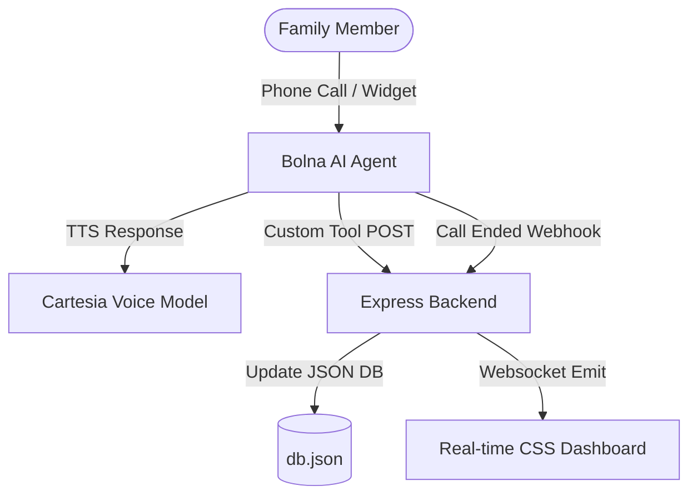

# Implementation Plan - NestFlow (Multilingual Voice Household Manager)

NestFlow is a voice-activated household manager designed for families to log groceries, assign chores, and coordinate domestic help over a simple phone call, instantly syncing to a real-time digital dashboard. The core of this system integrates **Bolna AI** for dialog flow management, **Cartesia** for natural, ultra-low-latency voice synthesis, and a custom **Node.js/Express** backend with **Socket.io** to power the live dashboard.

---

## User Review Required

> [!IMPORTANT]
> **Cartesia Voice Model Setup (MANDATORY for submission)**
> You must have a Cartesia API key or credits enabled on the Bolna dashboard (credits are enabled within 24 hours of creating the account). During agent setup, you need to select **Cartesia** as the TTS provider. **Verify a Cartesia voice works end-to-end before writing any code** — if credits are not yet live, that blocks the one hard requirement of the contest and is the critical path, not the backend.
>
> **Multilingual Configuration (core differentiator)**
> The pitch is *multilingual* household management (e.g. coordinating with domestic help in Hindi/regional languages). Cartesia TTS alone does not make the agent multilingual — you must also set the Bolna agent's **language and transcriber (STT)** to the target language. Plan: (a) select a **Cartesia multilingual / Indian voice**, (b) configure Bolna language + STT to match, (c) demo at least one non-English exchange.
>
> **Exposing the Backend (ngrok)**
> Since the Bolna agent is hosted in the cloud, it needs to access your local server. We will guide you to use `ngrok` (or a similar tool) to create a public HTTPS tunnel to your local backend port (e.g., `http://localhost:3000`).

---

## Technical Architecture



### Data Schema (`db.json`)
We will use a simple, persistent JSON file-based database.

```json
{
  "groceries": [
    {
      "id": "uuid",
      "item": "Milk",
      "quantity": "2 Litres",
      "category": "Dairy",
      "bought": false,
      "createdAt": "ISO-Timestamp"
    }
  ],
  "chores": [
    {
      "id": "uuid",
      "title": "Clean kitchen counters",
      "assignee": "Achyut",
      "priority": "high",
      "notes": "After dinner",
      "completed": false,
      "createdAt": "ISO-Timestamp"
    }
  ],
  "instructions": [
    {
      "id": "uuid",
      "instruction": "Cook paneer butter masala for dinner",
      "recipient": "Cook",
      "priority": "medium",
      "createdAt": "ISO-Timestamp"
    }
  ],
  "calls": [
    {
      "id": "uuid",
      "callId": "bolna-call-id",
      "transcript": "...",
      "summary": "...",
      "duration": 45,
      "timestamp": "ISO-Timestamp"
    }
  ]
}
```

---

## Proposed Changes

### Component 1: Express Server & WebSocket Setup

#### [NEW] [server.js](file:///c:/Users/achyu/Bolna-Voc-a-thon/server.js)
Sets up the Express server, parses JSON requests, connects Socket.io, loads endpoints, and handles local database sync.

*   **Custom Tool API Endpoints (called by Bolna)**:
    *   `POST /api/groceries`: Adds/removes groceries.
    *   `POST /api/chores`: Creates/assigns chores.
    *   `POST /api/instructions`: Logs household help instructions.
    *   `GET /api/summary`: Returns current list of pending tasks, groceries, and instructions. Bolna uses this response to answer questions (e.g., "What needs to be bought?").
*   **Webhook Endpoints**:
    *   `POST /api/webhook/call-ended`: Captures completed calls and pushes transcripts to the dashboard.
*   **Dashboard API Endpoints (called by Frontend)**:
    *   `GET /api/dashboard`: Hydrates UI with current database state.
    *   `POST /api/manual/...`: Manual toggle/delete support for groceries, chores, instructions.

#### [NEW] [db.js](file:///c:/Users/achyu/Bolna-Voc-a-thon/db.js)
Handles reading/writing to `db.json` synchronously or safely with lock files to prevent race conditions during parallel requests from the voice agent.

---

### Component 2: Frontend Dashboard (Vanilla HTML, CSS, JS)

#### [NEW] [style.css](file:///c:/Users/achyu/Bolna-Voc-a-thon/public/style.css)
A premium dark-themed, glassmorphism user interface:
*   **Colors**: Custom HSL dark palette (deep slates, dark indigos, translucent card backdrops).
*   **Typography**: Inter and Outfit Google Fonts for a sleek, modern UI.
*   **Animations**: CSS transitions for checking off grocery items, smooth list slide-ins when items are added in real-time, and pulse effects for active voice sessions.

#### [NEW] [index.html](file:///c:/Users/achyu/Bolna-Voc-a-thon/public/index.html)
Defines the layout:
*   **Top Bar**: App name, real-time WebSocket status, quick statistics.
*   **Grid Layout**:
    *   *Column 1*: Groceries board with categories.
    *   *Column 2*: Chores board (styled like a list/kanban board).
    *   *Column 3*: Domestic help instructions table.
    *   *Bottom Section*: Expandable voice interaction logs (transcripts & duration).

#### [NEW] [app.js](file:///c:/Users/achyu/Bolna-Voc-a-thon/public/app.js)
Connects to the server's Socket.io instance. Listens for updates and dynamically re-renders elements with micro-animations. Implements manual trigger handlers for dashboard convenience.

---

### Component 3: Project Configuration & Documentation

#### [NEW] [package.json](file:///c:/Users/achyu/Bolna-Voc-a-thon/package.json)
Standard Node.js package metadata listing dependencies: `express`, `socket.io`, `uuid`, `dotenv`.

#### [NEW] [README.md](file:///c:/Users/achyu/Bolna-Voc-a-thon/README.md)
Detailed walkthrough explaining:
1.  How to run the Node.js project.
2.  How to start `ngrok` to tunnel to port `3000`.
3.  How to configure the Bolna agent (System Prompt, **language + transcriber/STT for the target language**, and TTS set to a **Cartesia multilingual voice**).
4.  The schemas for the **4 Custom Tools** in **Bolna's exact `custom_task` format** (see below) so the user can copy-paste them directly into Bolna's Tools Tab.
5.  How to set up the Bolna Webhook in the **Analytics Tab** (post-call data: transcript, summary, duration).

> [!NOTE]
> **Bolna tool schema is NOT plain OpenAI JSON** — it wraps the function definition with `key: "custom_task"` and a `value` block that maps params using **Python format specifiers** (`%(x)s` string, `%(x)i` int, `%(x)f` float). For **GET** tools params become a query string; for **POST** tools they go in the body. Each tool should include a `pre_call_message` to mask network latency during the live call. Example:
>
> ```json
> {
>   "name": "add_grocery",
>   "description": "Call when the user wants to add a grocery item to the shopping list",
>   "pre_call_message": "Sure, adding that now.",
>   "parameters": {
>     "type": "object",
>     "properties": {
>       "item": { "type": "string", "description": "Grocery item name" },
>       "quantity": { "type": "string", "description": "Amount e.g. '2 litres'" }
>     },
>     "required": ["item"]
>   },
>   "key": "custom_task",
>   "value": {
>     "method": "POST",
>     "param": { "item": "%(item)s", "quantity": "%(quantity)s" },
>     "url": "https://<your-ngrok>.ngrok-free.app/api/groceries",
>     "api_token": "",
>     "headers": {}
>   }
> }
> ```
>
> **Backend implication:** endpoints must parse what Bolna actually sends — `/api/groceries`, `/api/chores`, `/api/instructions` read from the POST body; `/api/summary` reads from the query string (or takes no params).

---

## Verification Plan

### Critical Path (do this FIRST, before coding)
0.  **Cartesia sanity check**: Confirm Cartesia credits are live and a Cartesia multilingual voice plays back in a test Bolna agent. This is the one mandatory submission requirement; if it isn't working, nothing else matters.

### Automated/Local Tests
1.  **Server Startup**: Run `node server.js` to ensure the server starts and serves the public static folder on port `3000`.
2.  **API Verification**:
    *   Use `curl` or Postman to invoke `POST /api/groceries`, `POST /api/chores`, and `POST /api/instructions` **using the exact param shape Bolna sends** (POST body). Ensure elements are correctly appended to `db.json` and Socket.io broadcasts the changes.
    *   Verify `GET /api/summary` (query string / no params) returns the expected payload format for Bolna's LLM context.

### Manual Verification
1.  Verify the web UI is visually stunning, responsive, and updates instantly upon API requests without requiring page refreshes.
2.  Set up a public URL using `ngrok` and trigger mock payloads simulating Bolna's custom tool invocations to see items pop up on the dashboard.
3.  **End-to-end multilingual call**: Place a real call through the Bolna agent and complete at least one **non-English exchange** (e.g. add a grocery in Hindi), confirming the item appears live on the dashboard and the call transcript/summary arrives via the Analytics webhook.
